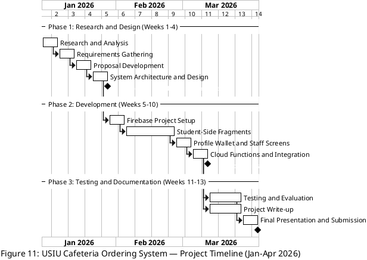

# Chapter 4 Figures — Project Management

---

## Figure 11: Gantt Chart — USIU Cafeteria Ordering System Project Timeline

```plantuml
@startgantt Figure11_GanttChart
<style>
ganttDiagram {
  task {
    BackGroundColor white
    LineColor black
    FontColor black
  }
  milestone {
    BackGroundColor black
    FontColor white
    LineColor black
  }
  separator {
    BackGroundColor white
    FontColor black
    LineColor black
  }
}
</style>
caption Figure 11: USIU Cafeteria Ordering System — Project Timeline (Jan–Apr 2026)
printscale weekly

project starts 2026-01-01

-- Phase 1: Research and Design (Weeks 1-4) --
[Research and Analysis] lasts 1 week
[Requirements Gathering] lasts 1 week
[Requirements Gathering] starts at [Research and Analysis]'s end
[Proposal Development] lasts 1 week
[Proposal Development] starts at [Requirements Gathering]'s end
[System Architecture and Design] lasts 1 week
[System Architecture and Design] starts at [Proposal Development]'s end
[M1 Research and Design Complete] happens at [System Architecture and Design]'s end

-- Phase 2: Development (Weeks 5-10) --
[Firebase Project Setup] lasts 1 week
[Firebase Project Setup] starts at [System Architecture and Design]'s end
[Student-Side Fragments] lasts 3 weeks
[Student-Side Fragments] starts at [Firebase Project Setup]'s end
[Profile Wallet and Staff Screens] lasts 1 week
[Profile Wallet and Staff Screens] starts at [Student-Side Fragments]'s end
[Cloud Functions and Integration] lasts 1 week
[Cloud Functions and Integration] starts at [Profile Wallet and Staff Screens]'s end
[M2 Implementation Complete] happens at [Cloud Functions and Integration]'s end

-- Phase 3: Testing and Documentation (Weeks 11-13) --
[Testing and Evaluation] lasts 2 weeks
[Testing and Evaluation] starts at [Cloud Functions and Integration]'s end
[Project Write-up] lasts 2 weeks
[Project Write-up] starts at [Cloud Functions and Integration]'s end
[Final Presentation and Submission] lasts 1 week
[Final Presentation and Submission] starts at [Testing and Evaluation]'s end
[M3 Project Complete] happens at [Final Presentation and Submission]'s end

@endgantt
```
