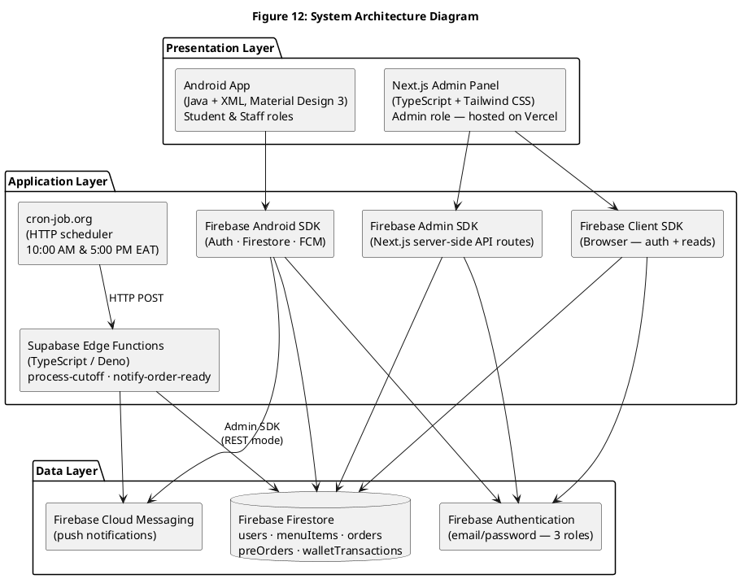
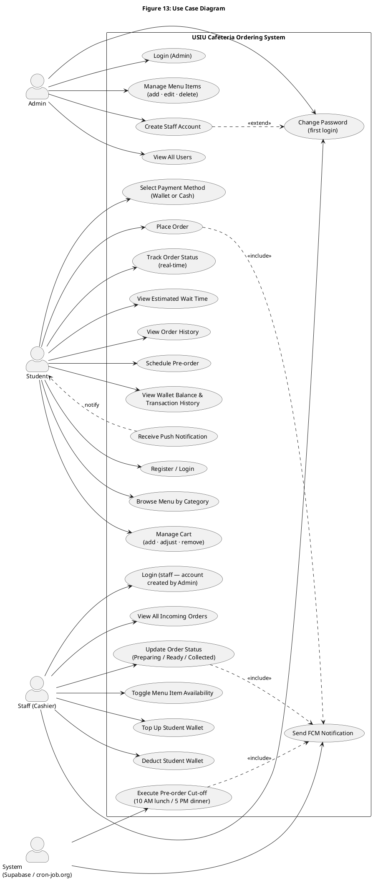
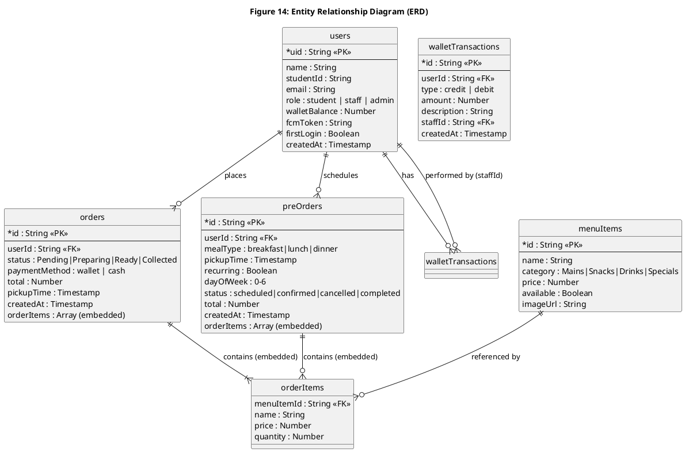
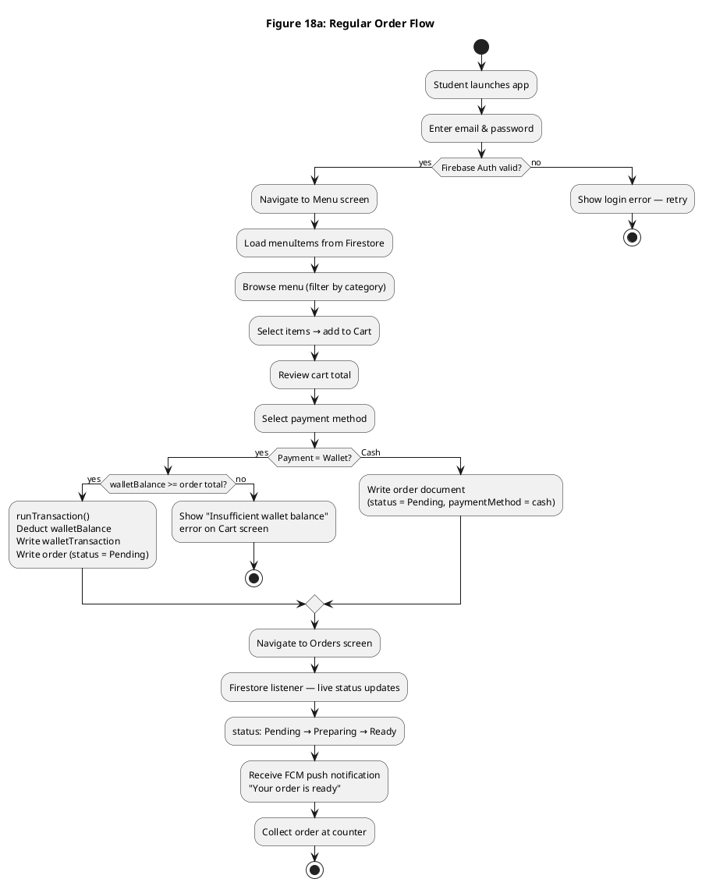
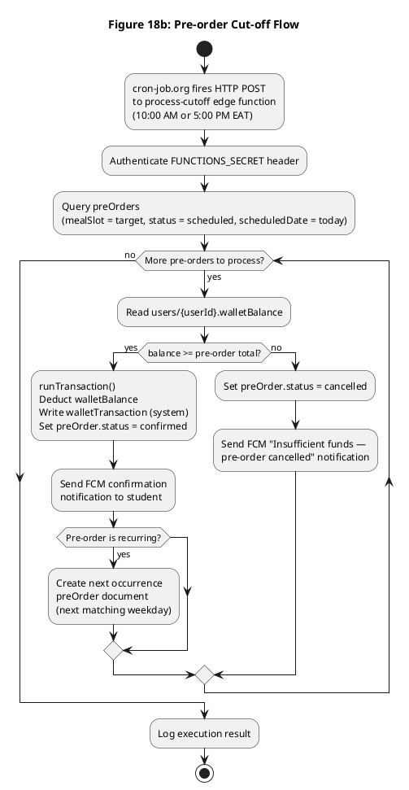
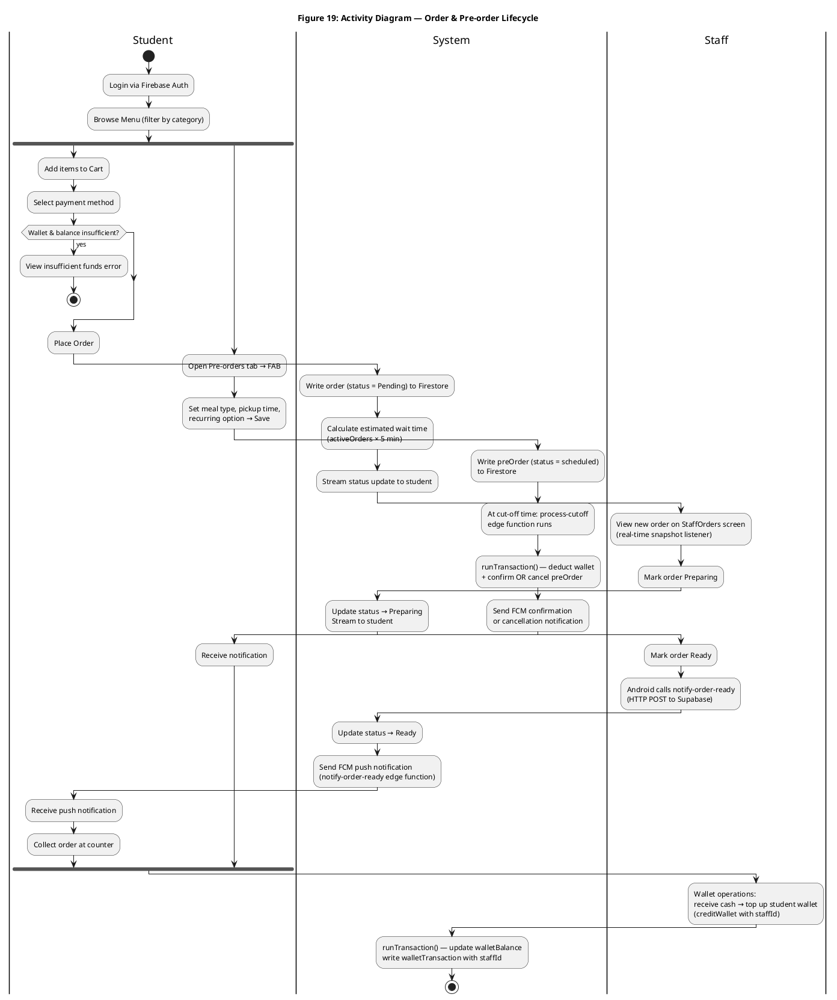
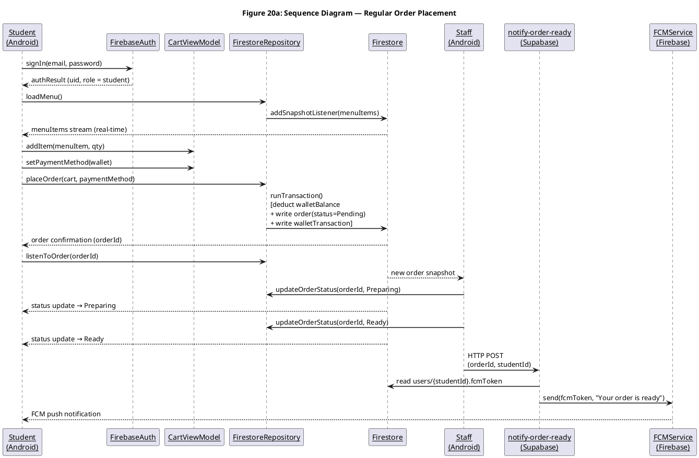
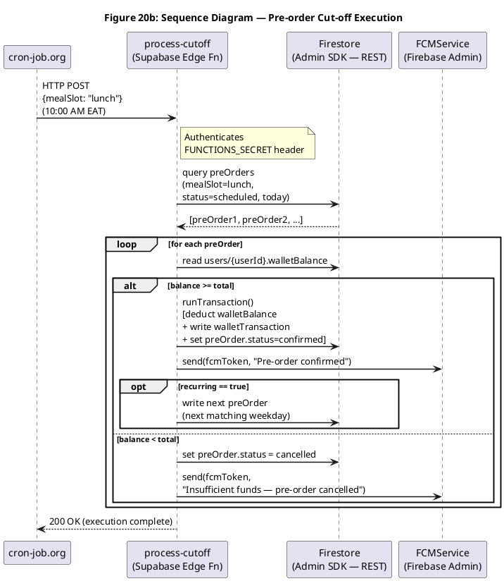
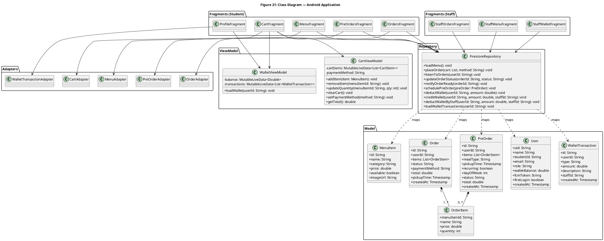

# Chapter 5 — Figures (PlantUML)

Render each block with PlantUML (e.g. `plantuml -tpng ch-5.md` or paste into https://www.plantuml.com/plantuml/uml/).
Figures marked **[NOT PLANTUML — placeholder]** must be drawn manually (Figma, draw.io, Lucidchart, etc.).

---

## Figure 12: System Architecture Diagram

---

## Figure 13: Use Case Diagram

---

## Figure 14: Entity Relationship Diagram (ERD)

---

## Figure 15: Level 0 Context Diagram

> **[NOT PLANTUML — placeholder]**
> Draw manually in draw.io / Lucidchart using standard DFD notation:
> - External entities (rectangles): Student, Staff, Admin, System (cron-job.org / Supabase)
> - Single central process circle: "USIU Cafeteria Ordering System"
> - Data flows (arrows): menu requests, order data, pre-order schedules, wallet queries → System; menu data, confirmations, status updates, notifications, wallet info ← System; order status updates, menu changes, wallet ops → System; incoming orders, updated menus ← System; menu CRUD, staff account creation → System; menus, user directory ← System; scheduled cut-off triggers → System.

---

## Figure 16: Level 1 DFD

> **[NOT PLANTUML — placeholder]**
> Draw manually in draw.io / Lucidchart using standard DFD notation.
> Processes (numbered circles): 1. Authenticate User, 2. Load Menu, 3. Manage Cart, 4. Place Order, 5. Deduct Wallet, 6. Track Order, 7. Send Notification, 8. Manage Pre-order, 9. Execute Cut-off, 10. Staff: Update Order Status, 11. Staff: Manage Menu, 12. Staff: Wallet Operation, 13. Admin: Manage Users.
> Data stores (open rectangles): D1 users, D2 menuItems, D3 orders, D4 preOrders, D5 walletTransactions.
> External entities (rectangles): Student, Staff, Admin, cron-job.org.

---

## Figure 17: Level 2 DFD

> **[NOT PLANTUML — placeholder]**
> Draw manually in draw.io / Lucidchart. Expand two processes from Level 1:
>
> **Place Order sub-processes:** 4.1 Receive cart & payment selection, 4.2 Validate cart & item availability, 4.3 Check walletBalance >= total (wallet path), 4.4 runTransaction() — deduct balance + write walletTransaction + write order(Pending), 4.5 Return error if insufficient, 4.6 Write order(Pending) directly (cash path), 4.7 Return orderId, 4.8 Clear CartViewModel.
>
> **Execute Cut-off sub-processes:** 9.1 Receive cron HTTP POST + authenticate FUNCTIONS_SECRET, 9.2 Query preOrders (mealSlot, status=scheduled, today), 9.3 Read walletBalance per pre-order, 9.4 runTransaction() — deduct + confirm (if sufficient), 9.5 Cancel + send FCM (if insufficient), 9.6 Create next recurring occurrence, 9.7 Log result.

---

## Figure 18a: Flowchart A — Regular Order Flow

---

## Figure 18b: Flowchart B — Pre-order Cut-off Flow

---

## Figure 19: Activity Diagram — Full Order Lifecycle (Swimlanes)

---

## Figure 20a: Sequence Diagram A — Regular Order Placement

---

## Figure 20b: Sequence Diagram B — Pre-order Cut-off

---

## Figure 21: Class Diagram

---

## Figure 22: Wireframes

> **[NOT PLANTUML — placeholder]**
> Design manually in Figma / draw.io. Required screens:
>
> **Android app (Student):** Menu (ChipGroup filter bar + grid of item cards with image, name, price, Add button), Cart (item list with quantity stepper, wallet balance chip, estimated wait label, Place Order button), Orders (Active/History tabs, status chips: grey=Pending / blue=Preparing / green=Ready), Pre-orders (card list with meal type badge + Scheduled chip, FAB to add), Profile/Wallet (balance card, transaction list).
>
> **Android app (Staff):** StaffOrders (order cards with student name, items, total, Start Preparing / Mark Ready buttons), StaffMenu (item list with availability toggle switch), StaffWallet (student ID input, amount input, Top Up / Deduct buttons).
>
> **Next.js Admin Panel:** Login page, Menu Management table (add/edit/delete rows), Staff Account Creation form, Users Directory (students tab + staff/admin tab).
