# Chapter 6 Figures — System Implementation

Figures that show running app screens, Firestore console views, code listings, CLI output, or external dashboard screenshots cannot be generated by PlantUML and are marked as placeholders. Figures that illustrate architectural flows, integration sequences, or structural relationships are provided as PlantUML source.

---

## Figure 23: LoginActivity — Firebase Authentication flow and role-based routing

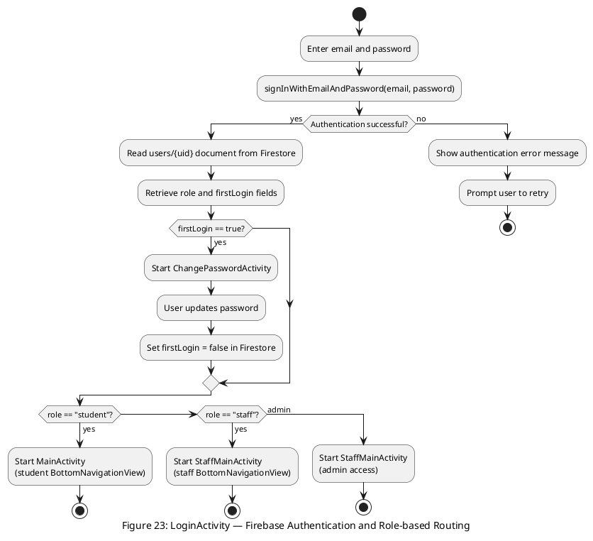

---

## Figure 24: MenuFragment — category chip filter and item grid

> **[NOT PLANTUML — placeholder]**
> Screenshot of the Android app MenuFragment showing: horizontal ChipGroup with All / Breakfast / Lunch / Dinner chips at top; RecyclerView grid of item cards each with Glide-loaded image, name, price in KES, and Add to Cart button; a Sold Out chip on unavailable items with greyed-out button.

---

## Figure 25: CartFragment — quantity stepper, wallet/cash toggle, and Place Order

> **[NOT PLANTUML — placeholder]**
> Screenshot of the Android app CartFragment showing: item list with minus/plus quantity steppers; subtotal and estimated wait time label; RadioGroup toggling between Wallet (with live balance display) and Cash payment methods; insufficient-balance warning label; Place Order button.

---

## Figure 26: ProfileWalletFragment — balance card and transaction history

> **[NOT PLANTUML — placeholder]**
> Screenshot of the Android app ProfileWalletFragment showing: wallet balance card at top; RecyclerView list of wallet transactions with green credit arrows and red debit arrows, description, amount, and timestamp per row; Logout button at bottom.

---

## Figure 27: StaffOrdersFragment — real-time order queue with action buttons

> **[NOT PLANTUML — placeholder]**
> Screenshot of the Android app StaffOrdersFragment showing: order cards each displaying student name, item list with quantities, total amount, payment method chip, and current status; action buttons: Start Preparing / Mark Ready / Mark Collected advancing the order lifecycle.

---

## Figure 28: StaffWalletFragment — student lookup form and credit/debit entry

> **[NOT PLANTUML — placeholder]**
> Screenshot of the Android app StaffWalletFragment showing: student ID input field with Find Student button; student name and current balance display after lookup; amount entry field; Credit / Debit radio selection; Confirm button.

---

## Figure 29: Next.js admin panel — Staff Account Creation and Users Directory

> **[NOT PLANTUML — placeholder]**
> Screenshot of the Next.js admin panel (desktop browser) showing two pages: (1) Staff Account Creation form with name, email, and temporary password fields; (2) Users Directory with separate tables for students and staff/admin accounts, each displaying uid, name, email, and role.

---

## Figure 30: Firestore console — five-collection data model

> **[NOT PLANTUML — placeholder]**
> Screenshot of the Firebase Firestore console showing the five root collections (users, menuItems, orders, preOrders, walletTransactions) in the left panel, with a representative document expanded to show its full field structure in the right panel.

---

## Figure 31: FirestoreRepository — key method signatures

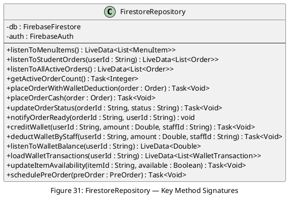

---

## Figure 32: MVVM data flow — CartViewModel and WalletViewModel

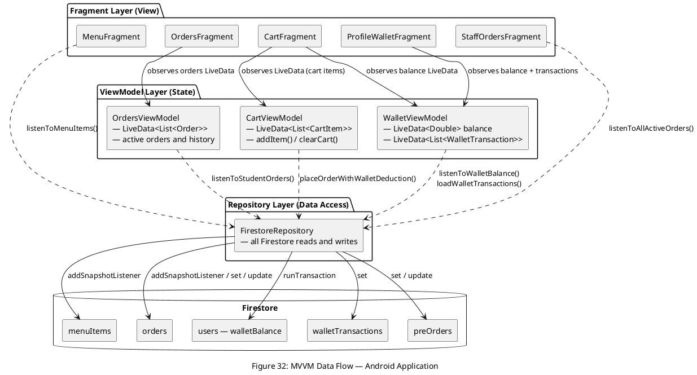

---

## Figure 33: Supabase Edge Function (process-cutoff) — logic flow

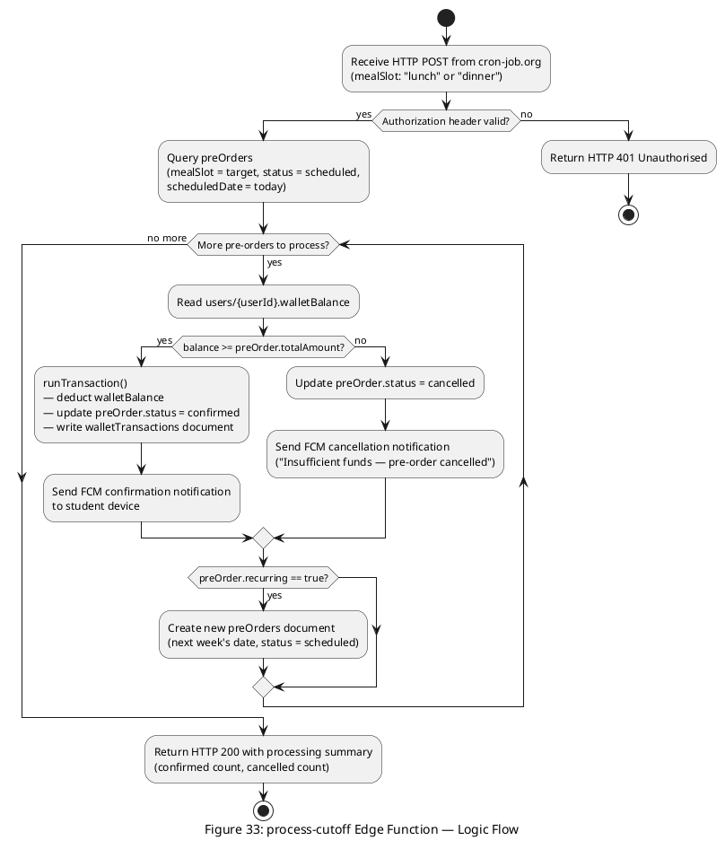

---

## Figure 34: MainActivity navigation — hide/show fragment pattern

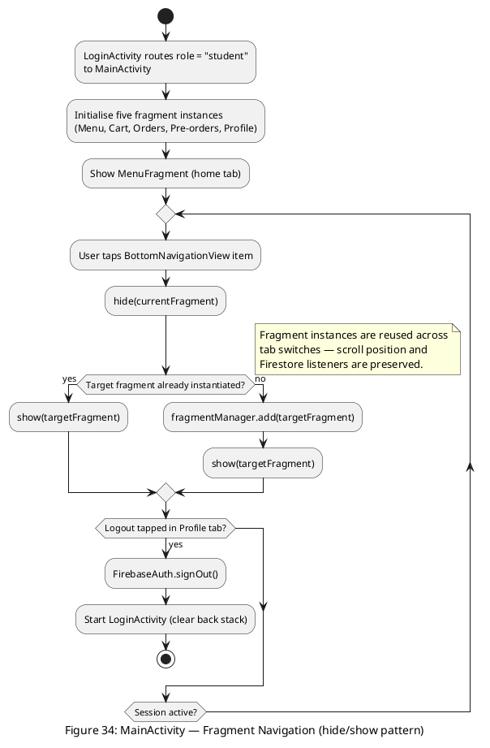

---

## Figure 35: Cart-Wallet integration — placeOrderWithWalletDeduction()

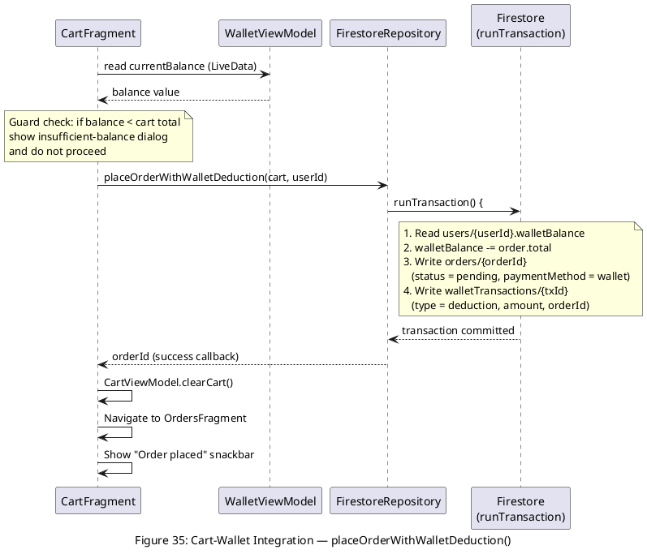

---

## Figure 36: Order status pipeline — staff marks Ready to FCM notification

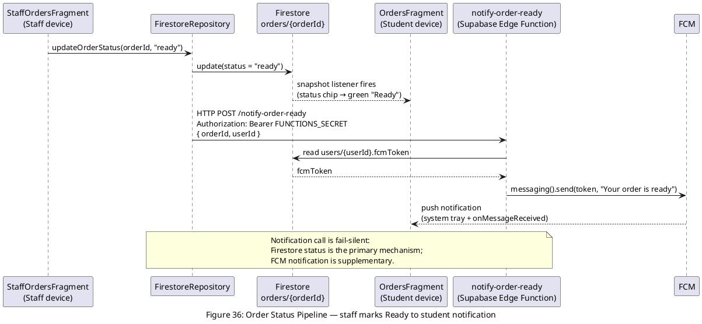

---

## Figure 37: Pre-order cut-off integration — end-to-end automated pipeline

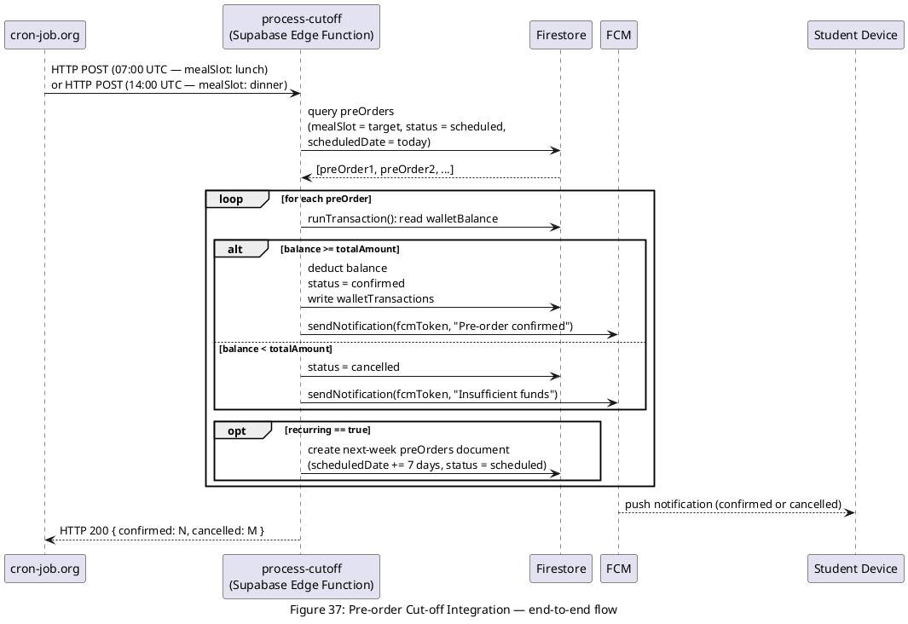

---

## Figure 38: Firebase Authentication API — student registration flow

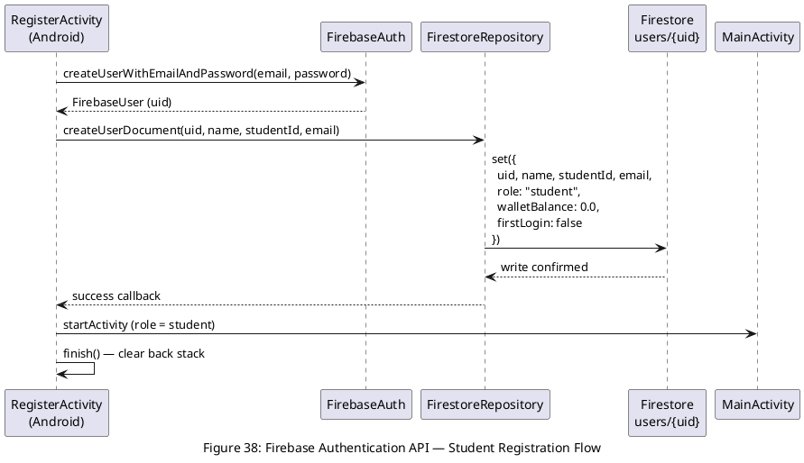

---

## Figure 39: Firebase Firestore SDK — addSnapshotListener implementation

> **[NOT PLANTUML — placeholder]**
> Code screenshot from FirestoreRepository.java showing the listenToStudentOrders() method body: the db.collection("orders").whereEqualTo("userId", userId).orderBy("createdAt", Query.Direction.DESCENDING).addSnapshotListener() call, the QuerySnapshot loop converting documents to Order objects via toObject(Order.class), and the MutableLiveData.postValue() call returning the live list.

---

## Figure 40: FCM SDK integration — token rotation and notification dispatch

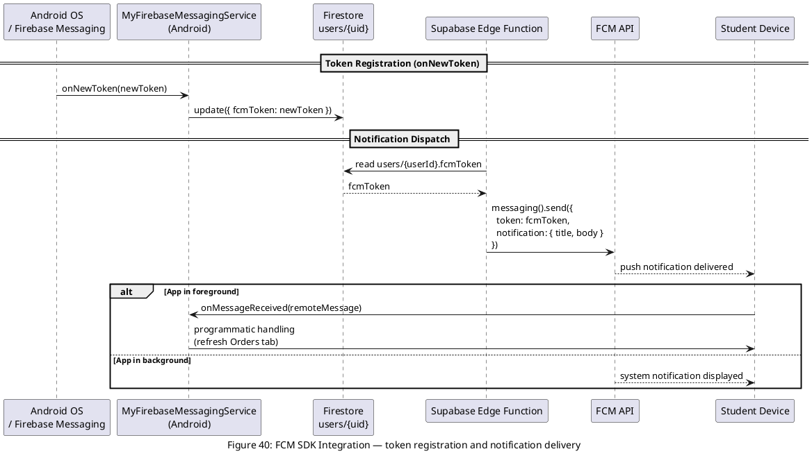

---

## Figure 41: Supabase Edge Functions HTTP API — Android HTTP POST to notify-order-ready

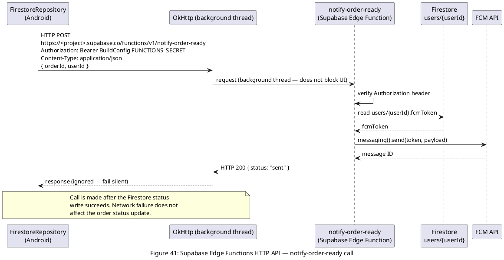

---

## Figure 42: Firebase Admin SDK in Next.js API route — staff account creation

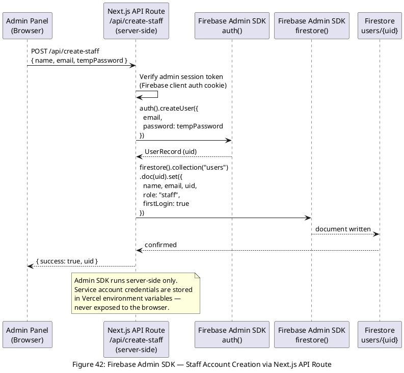

---

## Figure 43: Android build.gradle — dependencies and BuildConfig field

> **[NOT PLANTUML — placeholder]**
> Screenshot or code block of the module-level build.gradle showing: Firebase BOM dependency block with firestore-ktx, auth, and messaging modules; Material Design 3 library; Glide with annotationProcessor; AndroidX ViewModel and LiveData; and the buildConfigField declaration for FUNCTIONS_SECRET reading from gradle.properties.

---

## Figure 44: Firestore security rules — helper functions and collection-level rules

> **[NOT PLANTUML — placeholder]**
> Screenshot or code block of firestore.rules showing: the four helper functions isStudent(), isStaff(), isAdmin(), isPrivileged(); and representative collection-level match blocks for /users/{uid}, /orders/{orderId}, /walletTransactions/{txId}, and /menuItems/{itemId} with allow read/write conditions referencing the helpers.

---

## Figure 45: Supabase CLI deployment — functions deploy and secrets set

> **[NOT PLANTUML — placeholder]**
> Screenshot of terminal output showing: supabase functions deploy process-cutoff and supabase functions deploy notify-order-ready commands with success output; and supabase secrets set FUNCTIONS_SECRET=... and GOOGLE_SERVICE_ACCOUNT=... commands confirming secret storage.

---

## Figure 46: cron-job.org scheduling configuration — two HTTP POST jobs

> **[NOT PLANTUML — placeholder]**
> Screenshot of the cron-job.org web dashboard showing the two configured jobs: Job 1 — 07:00 UTC daily, HTTP POST to process-cutoff URL, mealSlot: lunch, Authorization header set; Job 2 — 14:00 UTC daily, HTTP POST to process-cutoff URL, mealSlot: dinner, Authorization header set. Execution history log showing HTTP 200 responses.

---

## Figure 47: Vercel deployment dashboard — Next.js admin panel

> **[NOT PLANTUML — placeholder]**
> Screenshot of the Vercel project dashboard showing: the cafeteria-app/admin/ root directory configuration; latest production deployment with build log output; environment variable list (Firebase service account fields and NEXT_PUBLIC_ Firebase config fields); and the production deployment URL.
